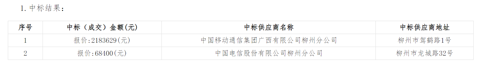

# 大数据分析 - feat-scrapy 分支

本分支主要用于爬取政府数据

## 爬取数据内容
政府采购数据中的 **结果公告**：

1. 公开招标
2. 竞争磋商
3. 竞争谈判
4. 废标

---


## 爬取API分析

### 公告地区代码
GET www.ccgp-guangxi.gov.cn/api/core/remote/announcementDistrict

参数:
- `includeSelf`: 返回结果是否包含 `districtCode` 该地区
  - `true`: 返回 `districtCode` 对应地区的数据，`children` 是对应地区的子地区
  - `false`: 不包含 `districtCode` 该地区
  
- `districtCode`: 地区代码，指定地区时，返回该地区下所有子地区

- `queryWithCode`: 是否使用地区代码查询
  - `true`: 使用 `districtCode` 查询
  - `false`: 返回结果无任何数据

- `includeAllNode`: 是否返回所有地区数据
  - `true`: 返回所有地区数据
  - `false`: 默认仅返回子一级数据

- `filterNotActive`: 是否返回未激活的数据

- `timestamp`: 时间戳，毫秒级（不一定是请求的时间）


响应 json 格式:
```json lines
{
  "success": true, // 是否响应成功
  "code": "0000", // 响应码
  "message": "成功", // 响应信息
  "data": [ // 返回的数据, 是树形结构
    {
      "id": "2134", // 地区id
      "parentId": "2133", // 父地区id
      "code": "450100", // 地区代码
      "name": "南宁市", // 地区名称
      "fullName": "广西壮族自治区南宁市", // 地区全称
      "fullPathName": "南宁市", 
      "shortName": "广西南宁", // 地区简称
      "districtType": "010201", // 地区类型
      "isLeaf": false, // 是否是叶节点
      "status": 0, // 状态
      "children": null // 子地区, 数组
    },
  ]
}
```


### 结果公告列表

POST http://www.ccgp-guangxi.gov.cn/portal/category

参数:
- `pageNo`
- `pageSize`
- `categoryCode`: 公告类型
  - `ZcyAnnouncement2`: 结果公告
  - `ZcyAnnouncement3004`: 中标（成交）结果公告
  - `ZcyAnnouncement4005`: 中标公告
  - `ZcyAnnouncement4006`: 成交公告
  - `ZcyAnnouncement3007`: 废标公告
- `_t`: 毫秒级时间戳
- `publishDateBegin`、`publishDateEnd`：（可选）筛选公告的发布时间， 格式为`YYYY-MM-DD`


响应 json 格式:
```json lines
{
  "success": true, // 布尔值: 表示是否响应成功
  "result": { // 数据结果
    "data": {
      "total": int, // 数据的总条数
      "data": [ // 返回的数据列表
        {
          "articleId": "Y1Xs+Ya9sqZiYbm5sKeVqQ==", // 当前公告的id 
          "annId": null,
          "siteId": 61,  
          "firstCode": null,
          "parentId": null,
          "secondCode": null,
          "author": "广西恒耀项目管理有限公司", // 发表公告人
          "cover": null,
          "path": null,
          "pathName": "终止公告", // 公告类型
          "title": "那坡县应急管理局关于乡镇消防车及配套装备采购项目的终止公告", // 公告标题
          "content": null, 
          "publishDate": 1708251407000, // 发表日期时间戳
          "districtCode": "451026", // 所在地区的代码
          "gpCatalogCode": null,
          "gpCatalogName": "消防车", // 类别
          "procurementMethodCode": null,
          "procurementMethod": "公开招标", // 采购类型
          "bidOpeningTime": null,
          "projectCode": null,
          "projectName": null,
          "districtName": "广西壮族自治区百色市那坡县", // 地区名
          "districtNameList": null,
          "purchaseName": null,
          "rankCategoryName": null,
          "encryptId": null,
          "invalid": 0, // 是否失效
          "invalidDate": null,
          "isRenew": null,
          "announcementType": null,
          "ownerShotDepartmentName": null
        },
      ]
    }
  }
  
}
```


### 结果公告详情

GET http://www.ccgp-guangxi.gov.cn/portal/detail

参数：

- `articleId`：公告对应的Id
- `parentId`：（未知）可选
- `timestamp`：时间戳（可选）

```json lines
{
  "success": true,
  "result": {
    "data": {
      "title": "广西达苏泰工程咨询有限公司2023年凌云县乡村道路“三项工程”-通组路安全生命防护工程（下甲片区） 施工招标公告", // 标题
      "htmlTitle": null,
      "isCustomTitle": 0,
      "articleId": "j3fGSjOb9+s2L57ar0Y/MQ==", // 公告id
      "siteId": 61, 
      "author": "广西达苏泰工程咨询有限公司", // 招标商
      "projectCode": "E4510002866005744001", // 项目码
      "projectName": "2023年凌云县乡村道路“三项工程”-通组路安全生命防护工程（下甲片区）",
      "publishDate": 1701679601000,
      "documentNo": null,
      "redHeadFile": null,
      "rankCategoryName": null,
      "belongingName": "",
      "implementationDate": null,
      "announcementType": 8031,
      "isGovPurchase": false,
      "districtCode": "451027",
      "isGovernmentPurchaseService": null,
      "categoryNames": [
        "信息公告",
        "工程类公告",
        "建设工程招标公告"
      ],
      "isShowAttachment": false,
      "announcementLinkDtoList": [ // 一系列的公告列表
        {
          "articleId": "j3fGSjOb9+s2L57ar0Y/MQ==",
          "type": "ZcyAnnouncement11",
          "typeName": "其他公告",
          "isExist": true,
          "isCurrent": true,
          "url": null,
          "publishDate": "2023-12-04",
          "order": 11,
          "publishDateTime": null
        },
        {
          "articleId": "oVK267d+jO142nPSnFcsPw==",
          "type": "ZcyAnnouncement11",
          "typeName": "其他公告",
          "isExist": true,
          "isCurrent": false,
          "url": null,
          "publishDate": "2023-12-04",
          "order": 11,
          "publishDateTime": null
        },
        {
          "articleId": "uS8laLqslp1laAwYpXD+gw==",
          "type": "ZcyAnnouncement11",
          "typeName": "其他公告",
          "isExist": true,
          "isCurrent": false,
          "url": null,
          "publishDate": "2023-12-27",
          "order": 11,
          "publishDateTime": null
        },
        {
          "articleId": null,
          "type": "ZcyAnnouncement2",
          "typeName": "采购公告",
          "isExist": false,
          "isCurrent": false,
          "url": null,
          "publishDate": null,
          "order": 2,
          "publishDateTime": null
        },
        {
          "articleId": null,
          "type": "ZcyAnnouncement3",
          "typeName": "更正公告",
          "isExist": false,
          "isCurrent": false,
          "url": null,
          "publishDate": null,
          "order": 3,
          "publishDateTime": null
        },
        {
          "articleId": "eZoQH7iZwB9uoUswhbGgzw==",
          "type": "ZcyAnnouncement4",
          "typeName": "结果公告",
          "isExist": true,
          "isCurrent": false,
          "url": null,
          "publishDate": "2024-02-18",
          "order": 4,
          "publishDateTime": null
        },
        {
          "articleId": "stgSJ8mwnjDU7TIJrbsXVA==",
          "type": "ZcyAnnouncement5",
          "typeName": "合同公告",
          "isExist": true,
          "isCurrent": false,
          "url": null,
          "publishDate": "2024-02-18",
          "order": 5,
          "publishDateTime": null
        }
      ],
      "content": "<style id=\"fixTableStyle\" type=\"text/css\">th,td {border:1px solid #DDD;padding: 5px 10px;}</style>", // 详细内容（HTML格式）
      "click": 30, // 点击量
      "attachmentList": null,
      "attachmentVO": null,
      "dynamicNodeLinkList": null,
      "expireFlag": 0,
      "expiredAt": "2023-12-07T15:59:59.000+0000",
      "challengeLink": null,
      "projectProcurementFlag": null,
      "announcementShowVo": null
    }
  },
  "error": null
}
```


分析：

- 需要爬取结果公告以及对应的采购公告，那么就可以从这里入手


## 解析响应内容

### 采购公告

#### 2015、2016、2017、2018、2019.1-2019.9.27年


api格式不变，但是相应内容变化：

- `author` 变为 `system`

- 文件格式不标准，很难有统一的格式进行解析

  - 一般按顺序来说：项目名称-> 项目编号 -> 采购类型 -> 采购方式 等

  - 存在特殊格式：

    - [平乐县革命烈士陵园维修工程（二期）、平乐县大发乡纪念塔维修工程竞标公告 (ccgp-guangxi.gov.cn)](http://www.ccgp-guangxi.gov.cn/site/detail?parentId=66485&articleId=IoM5X1CIG9eWH4IZ82k1iQ==)
    - [广西云龙招标有限公司凭祥市妇幼保健院物业服务采购（编号：YLCZG20154002-P）招标公告 (ccgp-guangxi.gov.cn)](http://www.ccgp-guangxi.gov.cn/site/detail?parentId=66485&articleId=HcSjibqF6ezW3gVnXL8/LQ==)

    - [广西建澜工程招标有限公司罗城县教育局农村教学点附属幼儿园设备设施采购 （GXJLLCG20150207）项目招标公告 (ccgp-guangxi.gov.cn)](http://www.ccgp-guangxi.gov.cn/site/detail?parentId=66485&articleId=vXdC+JW4MnpVbZleOw0UVA==)
    - [中经国际招标集团有限公司 关于贺州市平桂区公会镇、望高镇、沙田镇绿色照明工程项目邀请竞标人信息公示 (ccgp-guangxi.gov.cn)](https://www.ccgp-guangxi.gov.cn/site/detail?parentId=66485&articleId=fdbUyeS8Iyes5n24o6sdLg==)

- 数据部分没有标明预算金额，同时可能存在招标金额计算方式不统一的问题
- 预算数据格式不统一：
  - 中文数字+阿拉伯数字：http://www.ccgp-guangxi.gov.cn/site/detail?parentId=66485&articleId=6gDVZWvC1euJY6RM1WPrkw==
  - 阿拉伯数字+中文单位：http://www.ccgp-guangxi.gov.cn/site/detail?parentId=66485&articleId=3UFZ7zHf5bgCOrX0Dzbnww==

----


#### 2019.9.27~

从这里开始，顶部多出：


对应api多出 `announcementLinkDtoList` 数据，包含了对应的结果公告等信息

> 只有公告列表中子项前面标有地区名的才有：
>
> 
>
> 区别：公告列表api中返回的数据，`districtName` 不为空则表示为这种新公告

----


#### 2020年

已经大部分使用该模式：最顶部包含该采购招标的所有公告，随后是标题部分，最后是公告内容：

- 项目概况
- 项目基本情况
  - 项目编号
  - 项目名称
  - 预算金额 
  - 服务需求/采购需求
  - 质量要求
  - 设计服务时间
- 磋商人的资格要求
- 技术成果经济补偿
- 获取招标文件
- 提交磋商文件截止时间、开标时间和地点
- 公告期限
- 其他补充事宜
- 对本次招标提出询问，请按以下方式联系
  - 采购人
  - 采购代理机构
  - 监督部分名称


但是还是存在特殊的文件格式：

- 更为详细的文件内容：http://www.ccgp-guangxi.gov.cn/site/detail?parentId=66485&articleId=KKh3S81ljGgFJZf6+R8ipQ==

  部分似乎可以在 **更正公告** 中获取：http://www.ccgp-guangxi.gov.cn/site/detail?parentId=66485&articleId=nXu+aTsNhi00m1kmvphowA==

- 分标信息：http://www.ccgp-guangxi.gov.cn/site/detail?parentId=66485&articleId=880S9AyZV9J+8o3Lkr3dpA==

渲染出来的html样式不统一，感觉很难统一解析


#### 2022、2023、2024年

格式基本统一

> [广西壮族自治区政府采购中心关于广西医科大学综合楼电梯采购及安装（GXZC2024-G1-000083-CGZX ）的公开招标公告 (ccgp-guangxi.gov.cn)](http://www.ccgp-guangxi.gov.cn/site/detail?parentId=66485&articleId=I3v6MXY3i5S50cunOHdJbg==) 以此为例

观察网页结构以及响应内容格式


网页（上面图片）标题部分：

- **总标题**：对应 api 相应内容中的 `title` 
- **来源**：对应 api 响应内容中的 `author`
- **发布时间：**对应 api 相应内容中的 `publishDate`

网页其他部分：对应 api 相应内容中的 `content`（已经渲染好的HTML结构）


> 由上面的公告观察，建议是从2022年开始爬取，公告内容的格式较为统一

-----


### 结果公告

从2022年开始，公告内容格式逐渐标准

- 普通中标公告：

  http://www.ccgp-guangxi.gov.cn/site/detail?parentId=66485&articleId=XaboU64EhC2dPtn9E1X3Xg==

  

- 多项标中标公告

  - 数字报价

    http://www.ccgp-guangxi.gov.cn/site/detail?parentId=66485&articleId=ZTAiE9N8BFHlqceKVYXClg==

    

  - 百分比报价

    http://www.ccgp-guangxi.gov.cn/site/detail?parentId=66485&articleId=Iklc0Laa7+UftEloSmHwzQ==

    

    - 包含废标结果

      http://www.ccgp-guangxi.gov.cn/site/detail?parentId=66485&articleId=0rscebJZtUzt2BV6I1HZrg==

      

-----


### 分析

一个招标（采购）公告可能存在多个标项，每个标项都可能废标，因此需要存储每一个标项的结果：

- 中标序号、标项名称、中标供应商名称、中标供应商地址、结果：
  - 中标：中标（成交）金额
  - 废标：废标理由


## 确定Item格式

项目名称：`project_name` str

项目编号：`project_code` str

项目概况：`project_situation`str | None

采购方式：`procurement_method` str

预算总金额（元）：`budget` int

标项 `bid_items`: list

- 序号：`index`  int

- 标项名称：`name` str

- 结果：`result` dict

  - 是否中标：`is_win` bool
  - 中标供应商名称：`bider_name` str | None

  - 中标供应商地址：`bider_address` str | None
  - 中标（成交）金额：`bid_amount` int
  - 废标理由：`reason` str|None
  - 其他（备注）：`other` str|None

- 招标人（公司）/采购代理机构：`tenderer` str

- 采购人信息 `procurement_info`：

  - 名称：`name`
  - 地址：`address`
  - 联系人：`contact_person`
  - 联系方式：`contact_info`

- 采购代理机构信息： `tenderer_agency_info`

  - 名称：`name`
  - 地址：`address`
  - 联系人：`contact_person`
  - 联系方式：`contact_info`

- 采购公告发布时间：`procurement_publish_date`

- 采购公告id：`procurement_article_id`

- 结果公告发布时间：`result_publish_date`

- 结果公告id：`result_article_id`

- 爬取时间：`scrape_date`

- 附件：`attachments`

  - 名称：`name`
  - 链接：`link`

- 招标位置：`district_code`


## 解析结果公告content

观察各个例子


### 成交中标相关

标题：xxx成交公告、xxx成交结果公告、xxx中标公告、中标结果公告

一、项目编号

二、项目名称

三、中标（成交）信息

1. 中标结果


2. 废标结果

   

   

四、主要标的信息


五、评审专家（单一来源采购人员）名单

> 结构： 
>
> - xxx，xxx，xxx（采购人代表）
> - xxx，xxx，xxx
> - xxxx（采购人代表），xxx，xxx（采购人代表），xxx

六、代理服务收费标准及金额

- 1.代理服务收费标准：按国家发展计划委员会计价格[2002]1980号《招标代理服务费管理暂行办法》及发改价格[2011]534号文的规定的收费标准收取。          

  2.代理服务收费金额（元）：9995

- 1.代理服务收费标准：参照国家发展计划委员会文件关于印发《招标代理服务费管理暂行办法》的通知（计价格[2002]1980号）、《国家发展改革委员会办公厅关于招标代理服务收费有关问题的通知》（发改办价格[2003]857号）、发改价格[2011]534号文的规定服务类收费计算标准采用差额定率累进法计算出收费基准价格，采购代理收费以收费基准价格下浮5%按分标收取。代理服务费金额：1分标：人民币壹万陆仟叁佰陆拾玖元整（¥16369.00）；2分标：人民币壹万贰仟柒佰玖拾柒元整（¥12796.50）          

  2.代理服务收费金额（元）：0.00

- 1.代理服务收费标准：按采购文件第三章供应商须知前附表第32.3条规定，向成交供应商收取代理服务费。                    

  2.代理服务收费金额（元）：27000

七、公告期限 

八、其他补充事宜     

九、对本次公告内容提出询问，请按以下方式联系　　

1. 采购人信息     

   名 称

   地 址 

   联系方式   

2. 采购代理机构信息     

   名 称

   地 址

   联系方式

3. 项目联系方式

   项目联系人

   电 话


特别特殊：

- [广西海恒项目管理有限公司关于东投状元府配套道路工程中标结果公示 (ccgp-guangxi.gov.cn)](http://www.ccgp-guangxi.gov.cn/site/detail?parentId=66485&articleId=pG+5Zh7gpqlIoL8g7sH13w==&utm=site.site-PC-38919.1024-pc-wsg-secondLevelPage-front.431.35ef15d0d49911eebfe849982ce3905e)


###废标相关

标题：xxx废标公告、xxx废标（流标）公告、xxx结果公告、xxx终止公告

一、采购人名称

二、采购项目名称

三、采购项目编号

四、采购组织类型

五、采购方式

六、采购公告发布日期

七、预算总金额

> 格式：
>
> - 全数字无单位（ex：200000）
>
> - 人民币9950000.00元

八、废标理由

- 标项1：xxxxx

> 理由：
>
> - 采购文件第34页中的技术分的产品综合性能分的评审标准与政采云评审系统中的评分标准内容不一致，由于评分标准不一致，导致评审工作无法进行。
> - 至截标时间止有效供应商不足三家，项目流标。
> - 至提交投标文件截止时间，提交投标文件的供应商不足3家，本项目采购失败。
> - 有效供应商不足三家
> - 有效供应商不足3家，作废标处理

九、评审小组成员名单

> 格式：
>
> - `/`
> - xxx，xxx，xxx，xxx（采购人代表）...

十、 其它事项

十一、联系方式

1、采购代理机构名称

​	联系人

​	联系电话

​	地址

2、采购人名称

​	联系人

​	联系电话

​	地址


### xxx终止公告

**一、项目基本情况**

采购项目编号、项目编号

采购项目名称、项目名称

**二、项目终止的原因**

- 因故终止
- 因本项目采购计划有变，采购人决定终止本次采购活动。

**三、其他补充事项**

**四、凡对本次公告内容提出询问，请按以下方式联系。**

1. 采购人信息     

   名 称

   地 址 

   联系方式   

2. 采购代理机构信息     

   名 称

   地 址

   联系方式

3. 项目联系方式

   项目联系人

   电 话

